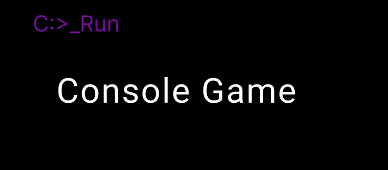

# Brief Description of the Game

This is a desktop game designed for the command line interface. Player explore a 2D map, where they can move, collect items, and manage their inventory.

The game is designed using Object-Oriented Programming (OOP) principles and is entirely 
developed in C++. It serves as a demonstration of OOP concepts within a simple, interactive environment.
# Badges


# Setting up the application

## 1. Clone the Repository

Clone the repository to your local machine. Open your terminal and run the following command:

```git clone https://github.com/Eraya13/Console_Game.git```

## 2. Install a Compiler and C++ IDE

Download IDE that supports C++ with proper compiler (e. g. GCC). You will need it to run it but firstly it needs to be build and compiled.

Recommended IDE: QT Creator (I make development in it) but different IDE is also possible.

### QT installation
Download Qt Creator (which includes a compiler) for windows: https://www.qt.io/download-dev

After downloading install Qt Creator (which includes a compiler). The installer includes both Qt Creator and the Qt libraries, along with a suitable compiler for your operating system.

Follow the installation instructions. It is nessecary to choose QT X.X (latest version) for desktop development in Installatio Folder section.

Note: For QT Creator is nessecary to have created account - check QT website for more information.

### Build of the Project in QT Creator

Once you have Qt Creator installed, you can build the project by following these steps:

1. Open Qt Creator
2. Go to "File" -> "Open File or Project" and select the Console_Game.pro file or CMakeLists.txt file in the root directory of the project
3. Qt Creator will configure the project and create a build directory
4. Click "Configure Project" and choose your preferred build settings if prompted
5. Click "Build" to compile the project.

***To be completed soon - proper action must be done next***
# System Requirements

The application can run only on Win. 10 or higher. It uses specific library only for windows.
# How To Use
# Known Limitations

- **No Game End Condition**
   - The game does not have a defined end condition such as winning or losing. The current implementation is designed to demonstrate the use of various object-oriented programming (OOP) principles and C++ practices rather than to provide a complete game experience.

- **Demonstration of OOP Principles**
   - The primary goal of this application is to showcase the implementation of OOP principles and notable C++ practices. Such as:
     - **Encapsulation**: Key data and methods are encapsulated within classes to manage complexity and enhance modularity.
     - **Single Responsibility Principle (SRP)**: Efforts have been made to ensure that each class handles a specific responsibility, making the codebase more manageable and extensible. However, due to the complexity of the project, there may be instances where responsibilities overlap.
     - **Separation of Concerns (SOC)**: The project is designed to separate different concerns, including a distinct separation between frontend and backend logic. The frontend classes handle user interactions or display information on the console, while the backend manages game logic and data processing.
     - **C++ Practices**: The code demonstrates the use of various C++ features that are key to the project's design, including:
       - **Static / Abstract / Normal Classes**: Effort to use of different class types for different purposes.
       - **Inheritance**: To enable code reuse and establish a hierarchy.
       - **Polymorphism**: To allow for flexible and dynamic behavior in the application.

This project is intended as a showcase of OOP principles applied to game behavior and may not include all features typically expected in a complete game.

Please be aware of these limitations when exploring the project. I am committed to continually improving the application, including its documentation, and refining the code through regular refactoring to ensure it remains valuable and well-maintained.

# Author - about me

I am a passionate developer of C/C++ and C#. Mostly I do Backend but for my projects I try both. What fascinates me about programming is the countless ways to express creativity. Besides that, I am a lover of fast rides in sports cars and anime.

# Contribution

I welcome contributions to improve this project! If you have suggestions for enhancements, bug fixes, or ideas for new features, please feel free to share them.

## How to Contribute

1. **Open an Issue**: If you encounter a bug, have a feature request, or notice something that could be improved, please open an issue in the [Issues section](https://github.com/Eraya13/Console_Game/issues) of this repository. Provide as much detail as you feel necessary to help me understand the problem or suggestion.

2. **Feedback and Suggestions**: Even if you're not a developer, your feedback is valuable! Feel free to provide suggestions on how the project could be improved or any issues you have encountered.

If you find this project useful or interesting, consider giving it a ⭐️ on GitHub. Your stars could help others to discover the project so I know much more what to improve on.

I strive to keep the project well-maintained and valuable, and your contributions help make it better. Thank you for your interest and support!
# License

## Creative Commons Attribution-NonCommercial 4.0 International (CC BY-NC 4.0)

This project is licensed under the Creative Commons Attribution-NonCommercial 4.0 International License.

You are free to:
- Share — copy and redistribute the material in any medium or format
- Adapt — remix, transform, and build upon the material

Under the following terms:
- Attribution — You must give appropriate credit, provide a link to the license, and indicate if changes were made. You may do so in any reasonable manner, but not in any way that suggests the licensor endorses you or your use.
- NonCommercial — You may not use the material for commercial purposes.

No additional restrictions — You may not apply legal terms or technological measures that legally restrict others from doing anything the license permits.

Full license text: https://creativecommons.org/licenses/by-nc/4.0/
